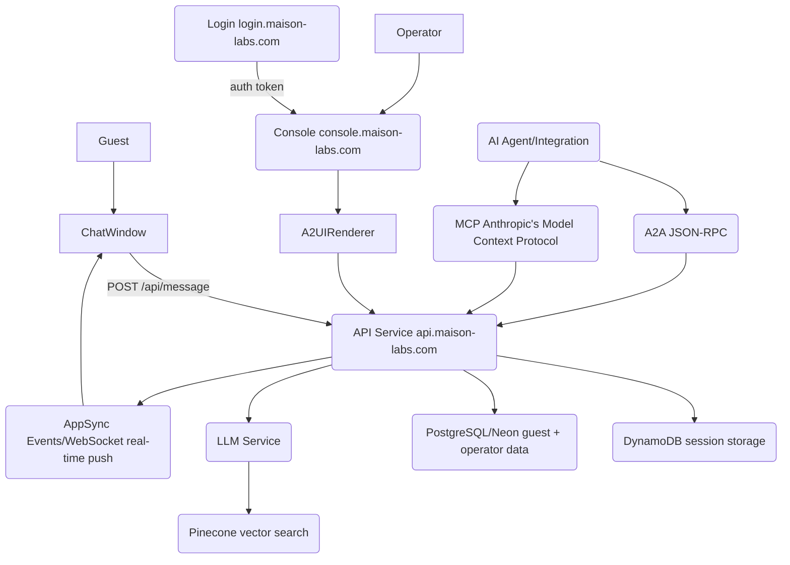

# Maison Architecture Overview

This document outlines the architectural overview of the Maison platform, detailing its core components, API interfaces, data stores, infrastructure, authentication model, and observability stack. It highlights a core design principle: all capabilities exposed via the REST API must also be accessible through Agent-to-Agent (A2A) and Model Context Protocol (MCP) interfaces.

## Key Concepts

API Interfaces (REST, A2A, MCP),Data Stores (PostgreSQL, DynamoDB, Pinecone, S3),Cloud Infrastructure (AWS ECS Fargate, CloudFront, AppSync, SES, SQS, Lambda),Authentication (Firebase Auth, HMAC API keys),Observability (OpenTelemetry, Grafana Tempo, Grafana Loki, Langfuse),A2UI Renderer,Agent-to-Agent (A2A),Model Context Protocol (MCP)

## Details

The Maison platform's architecture is structured around several key components, ensuring scalability, real-time capabilities, and robust data management.

## System Map (Mermaid)

## Three API Interfaces
Maison exposes its functionalities through three primary API interfaces:

| Interface | Path | Used by |
|---|---|---|
| [[REST API]] | `/api/...` | Console, chat widget, partner integrations |
| [[A2A]] | `/a2a` | [[AI]] agents using Agent-to-Agent JSON-RPC |
| [[MCP]] | `/mcp` | [[AI]] tools using Anthropic's Model Context Protocol |

A core design principle dictates that any capability exposed via the [[REST API]] must also be available via [[A2A]] and [[MCP]] interfaces.

## Data Stores
The platform leverages a mix of specialized data stores:

| Store | Technology | Contents |
|---|---|---|
| Primary DB | [[PostgreSQL]] ([[Neon]]) | Users, clients, KBs, roles, analytics, sessions |
| Session & task store | [[DynamoDB]] | Live chat sessions, [[A2A]] task state, client config cache |
| Vector DB | [[Pinecone]] | Embeddings for KB semantic search |
| File storage | [[S3]] | Client assets, quality test reports, prompt files |

## Infrastructure (AWS)
The infrastructure is primarily hosted on [[AWS]] and managed using [[AWS CDK]]:

-   **API and services** — [[ECS Fargate]] containers
-   **Frontends** — [[CloudFront]] + [[S3]] (static hosting)
-   **Real-time messaging** — [[AppSync Events]] ([[WebSocket]])
-   **Email** — [[SES]]
-   **Background processing** — [[SQS]] queues + [[Lambda]]
-   **Secrets** — [[AWS Secrets Manager]]
-   **Observability** — [[OpenTelemetry]] → [[Grafana Tempo]] (traces) + [[Grafana Loki]] (logs)
-   Three environment stacks (test/stg/prod) + shared observability stack.
-   All managed via [[AWS CDK]] in `infra/`.

## Auth Model
The [[Auth Model]] differentiates between human operators and programmatic access:

1.  **Operators** — [[Firebase Auth]]. The login application sets a session cookie. The Console verifies this via the `@maison-labs/auth` package.
2.  **Programmatic access** — [[HMAC]]-signed [[API keys]] issued per operator account.

## How the Console Works (A2UI)
The Console utilizes an [[A2UI]] Renderer for dynamic page generation:

1.  Console shell receives a navigation request.
2.  Calls the [[A2UI]] Renderer with a schema ID and the operator's authentication context.
3.  The Renderer looks up the schema (from `packages/a2ui-schemas`), fetches data from the [[API]], and returns HTML + CSS.
4.  The Console shell displays the result.

This design means adding or changing a console page primarily involves updating a JSON schema, rather than deploying new frontend code.

## Observability
Comprehensive observability is integrated to monitor system health and performance:

-   **[[Grafana Tempo]]** — Distributed tracing for request flows.
-   **[[Grafana Loki]]** — Structured logs for system events.
-   **[[Langfuse]]** — [[LLM]]-specific tracing, including prompt versions, token usage, and latency metrics.
-   Local access: `grafana.local.maison-labs.com`
-   Production access: `grafana.maison-labs.com`

## Related

[[API]],[[WebSocket]],[[LLM Model Constants and Company Info Helper (Commit a9513cd)]],[[PostgreSQL]],[[Neon]],[[DynamoDB]],[[Pinecone]],[[S3]],[[REST API]],[[A2A]],[[MCP]],[[AWS]],[[AWS CDK]],[[ECS Fargate]],[[CloudFront]],[[AppSync Events]],[[SES]],[[SQS]],[[Lambda]],[[AWS Secrets Manager]],[[OpenTelemetry]],[[Grafana Tempo]],[[Grafana Loki]],[[Auth Model]],[[Firebase Auth]],[[API keys]],[[HMAC]],[[A2UI]],[[AI]],[[Langfuse]],[[LLM]],[[Monorepo]]
